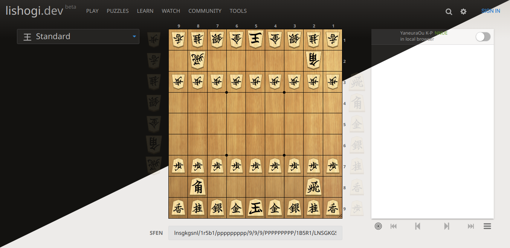

# [lishogi.org](https://lishogi.org)
==================================

Lishogi is your go-to platform for a thrilling shogi experience, combining real-time gameplay with ease of use. Built as a shogi counterpart to Lichess, Lishogi is a free online shogi game server designed with scalability and responsiveness in mind.

[](https://github.com/WandererXII/lishogi/actions?query=workflow%3A%22Build+server%22)
[](https://github.com/WandererXII/lishogi/actions?query=workflow%3A%22Build+assets%22)
[](https://crowdin.com/project/lishogi)
[](https://twitter.com/lishogi)
[](https://discord.gg/YFtpMGg3rR)



## Key Features

- [Server Analysis](https://lishogi.org/B8fAS7aW/gote) distributed with [shoginet](https://github.com/WandererXII/shoginet)
- [Local Analysis](https://lishogi.org/analysis)
- [Tournaments](https://lishogi.org/tournament)
- [Simuls](https://lishogi.org/simul)
- [Forums](https://lishogi.org/forum)
- [Teams](https://lishogi.org/team)
- [Puzzles](https://lishogi.org/training)
- [Search Engine](https://lishogi.org/games/search)
- [Shared Analysis Board](https://lishogi.org/study)

## Technology Stack

Lishogi is built with Scala 2.13 and relies on the Play framework. Key technologies include [scalatags](https://com-lihaoyi.github.io/scalatags/) for templating, [shogi](modules/shogi) submodule for pure shogi logic, and [Akka streams](http://akka.io) for full asynchronous support.

WebSocket connections are handled by a [separate server](https://github.com/WandererXII/lila-ws) communicating using [redis](https://redis.io/). The web client, crafted with [TypeScript](https://www.typescriptlang.org/) and [snabbdom](https://github.com/snabbdom/snabbdom), uses [Sass](https://sass-lang.com/) for CSS generation.

The [blog](https://lishogi.org/blog) is powered by free open content from [prismic.io](https://prismic.io).

[Join us on Discord](https://discord.gg/YFtpMGg3rR) for discussions and use [GitHub issues](https://github.com/WandererXII/lishogi/issues) for bug reports and feature requests.

## Credits

Lishogi is indebted to [ornicar](https://github.com/ornicar) and the entire [Lichess project](https://github.com/lichess-org/lila).

## Supported Browsers

| Browser           | Version | Notes                                       |
| ----------------- | ------- | ------------------------------------------- |
| Chromium / Chrome | last 10 | Full support, fastest local analysis        |
| Firefox           | 67+     | Full support, second fastest local analysis |
| Edge              | 91+     | Full support (reasonable support for 17+)   |
| Opera             | 55+     | Reasonable support                          |
| Safari            | 11.1+   | Reasonable support                          |

Upgrade your browsers to ensure optimal security and performance benefits.

## License

Li[shogi in scala]la is licensed under the GNU Affero General Public License 3 or any later version at your choice with an exception for Highcharts. See [LICENSE](/LICENSE) and [COPYING.md](/COPYING.md) for details. WIP

## Responsive Design

Experience Lishogi's responsive design, providing an optimal user interface across various devices, from desktops to smartphones.

## Copy Code

Clone the Lishogi repository:

```bash
git clone https://github.com/WandererXII/lishogi.git
